> ECE 445
>
> [Senior Design Laboratory]{.smallcaps}
>
> [Final Report]{.smallcaps}

**Automatic Humidity Sensing and Water Refilling Cool-Mist Humidifier**

> **Team No. 11**
>
> [Andrew Sherwin]{.smallcaps}
>
> (zyxie2@illinois.edu)
>
> Jalen Chen
>
> (jalenc3@illinois.edu) Woojin Kim
>
> (wkim51@illinois.edu)
>
> ***TA***: Surya Vasanth

***Professor***: Dr. Jonathon Schuh

May 1, 2024

## Abstract

Improper indoor humidity levels are a cause for health issues, such as
dry skin or inflamed sinus passages. With the majority of humidifiers on
the market being manually controlled, this causes an issue when no
operator is present. A room can be under-humidified or over-humidified
when there is no one to control the humidity output. As a result, we
propose a cost-effective humidifier that will mitigate this problem.
Concerned about the health of the operator, a cool-mist humidifier
design was chosen. This humidifier communicates via 2.4GHz WIFI with
multiple remote humidity sensors before determining the need to turn
itself on or off. When the humidifier filter needs more water, the
humidifier will activate a water valve that will irrigate the filter to
the perfect amount. With all the components combined, this humidifier
brings a new perspective to the humidifiers already on the market,
guaranteeing the safety and comfort of the user. A truly luxurious
experience.

# Table of Contents {#table-of-contents .TOC-Heading}

[Abstract [ii](#abstract)](#abstract)

[1 Introduction [iv](#introduction)](#introduction)

[1.1 Visual Aid [v](#visual-aid)](#visual-aid)

[1.2 Physical Design [vi](#physical-design)](#physical-design)

[1.3 High Level Requirements
[vii](#high-level-requirements)](#high-level-requirements)

[2 Design [viii](#design)](#design)

[2.1 Block Diagrams [viii](#block-diagrams)](#block-diagrams)

[2.2 Humidifier Subsystem
[xi](#humidifier-subsystem)](#humidifier-subsystem)

[2.2.1 Overview [xi](#overview)](#overview)

[2.2.2 Requirements [xiii](#requirements)](#requirements)

[2.2.3 Design Decisions [xiii](#design-decisions)](#design-decisions)

[2.3.4 Humidifier Subsystem RV Table
[xiv](#humidifier-subsystem-rv-table)](#humidifier-subsystem-rv-table)

[2.3 Humidity Sensor Subsystem
[xvi](#humidity-sensor-subsystem)](#humidity-sensor-subsystem)

[2.3.1 Overview [xvi](#overview-1)](#overview-1)

[2.3.2 Requirements [xvi](#requirements-1)](#requirements-1)

[2.3.3 Design Decisions
[xvii](#design-decisions-1)](#design-decisions-1)

[2.3.4 Humidity Sensor Subsystem RV Table
[xvii](#humidity-sensor-subsystem-rv-table)](#humidity-sensor-subsystem-rv-table)

[3 Cost Analysis [xviii](#cost-analysis)](#cost-analysis)

[3.1 Parts and Materials
[xviii](#parts-and-materials)](#parts-and-materials)

[3.2 Estimated Hours of Development
[xviii](#estimated-hours-of-development)](#estimated-hours-of-development)

[3.3 Approximate Total Cost
[xix](#approximate-total-cost)](#approximate-total-cost)

[4 Conclusion [xx](#conclusion)](#conclusion)

[4.1 Accomplishments and Uncertainties
[xx](#accomplishments-and-uncertainties)](#accomplishments-and-uncertainties)

[4.2 Future Work [xx](#future-work)](#future-work)

[5 Appendix [xxi](#appendix)](#appendix)

[5.1 Appendix A -- RV Table Verifications
[xxi](#appendix-a-rv-table-verifications)](#appendix-a-rv-table-verifications)

[5.2 Appendix B -- Schematics
[xxvi](#appendix-b-schematics)](#appendix-b-schematics)

[5.3 Appendix C -- Required Parts and Cost
[xxxii](#appendix-c-required-parts-and-cost)](#appendix-c-required-parts-and-cost)

[5.4 Appendix D -- Ethics and Safety
[xxxiv](#appendix-d-ethics-and-safety)](#appendix-d-ethics-and-safety)

[5.5 Appendix E - References [xxxvii](#_Toc165415281)](#_Toc165415281)

# 1 Introduction

The United States Environmental Protection Agency (EPA) strongly
suggests the regulation of indoor humidity to be between 30%-50% \[8\]
When indoor humidity falls within these ranges, pollutants, such as
chemicals, gasses, mold, and other airborne particles, are minimized in
the air. This ultimately helps with allergies, respiratory illnesses,
and other health issues. 

To maximize the health benefits of our product, we decided to implement
a cool mist humidifier. Unlike ultrasonic humidifiers and warm mist
humidifiers, this product does not disperse bacterial matters, minerals,
or cause your nasal passages, as the US Food and Drug Administration
(FDA) suggests \[25\]. To further improve humidifiers on the market, our
humidifier features an automatic-on function and an automatic water tank
filling function. The solution has three remote humidity sensors. These
sensors detect the humidity and communicate the humidity readings with
the humidifier. Using the average of these readings, with the
temperature accounted for, the humidifier decides whether it is
necessary to turn itself on or off. Inside the water tank of the
humidifier are two water sensors. One sensor detects whether more water
is needed, while the other sensor detects when to stop automatically
adding water. Furthermore, a webpage for the humidifier allows the user
to read the current humidity and temperature and has options to turn the
humidifier and water valve on manually. With all these improvements, we
push out a revolutionary humidifier system onto the market that has a
high level of autonomy, providing a luxurious product to the end-user.

## 

## 1.1 Visual Aid 

{width="6.5in"
height="3.0612401574803147in"}

###### Figure 1: Consumer Visual Aid \[26\]

The visual aid (*Figure 1:* Consumer Visual Aid \[26\]) supports better
understanding of how our product gives a solution to the suggested
problem. Water supplied through water input to the tank will be brought
to the filter located under the fan, then the fan will help to blow
water out to the air. After the humidifier receives humidity data from
the sensors, it will calculate then decide whether to turn the fan
on/off.

## 

## 1.2 Physical Design

{width="6.5in"
height="3.3333333333333335in"}

###### Figure 2 -- Component Visual Aid \[27\]

The physical design offers detailed information about inner components
of the product. Two water-level sensors will be located vertically on
the water tank to send fill/stop-fill signals to the ESP32 on the
humidifier to open/close the DC water valve. It also shows the water
filter that must be changed routinely to prevent potential hygiene
risks. After reading humidity data, the humidity sensor will send its
ESP32, then it will transmit the data to the humidifier ESP32 through
2.4GHz Wi-Fi.

## 1.3 High Level Requirements 

Our project would need to achieve a multitude of high-level goals to be
sufficiently complete. Some goals would include:

1.    The ESP32 can read data from the humidity sensor using the ESP32
microcontroller communication through the three different sensors placed
around the room, communicating all with ESPs via 2.4 GHz Wi-Fi with
continuous readings. This will allow us to use average humidity to
determine a good range for on/off functionality. 

2.    The filter irrigation system refills the water tank with water
depending on signals from two water level sensors at top and bottom of
the tank. The ESP32 will activate the 12V DC water valve, creating a
flow of water which will turn off when the top sensor detects water. The
measured max capacity of the water tank, according to manufacturer
specifications, should be 4.16 liters every 24 hours and the filter
should absorb around 150 milliliters ± 5 milliliters. 

3.    The humidifier should be operating between 35% and 50% humidity.
If the value is beyond 50, the humidifier turns off, and if below 35, it
turns on. With remote communication between the humidity sensor's ESP32
microcontroller and the humidifier's ESP32 microcontroller, there is a
theoretical estimation of 44ns response time to the activation and the
deactivation of the humidifier's fans, when algorithm and code run-times
are not considered. Furthermore, high voltage parts of the PCB will not
affect the ESP32 and other low voltage parts.

# 2 Design

## 2.1 Block Diagrams

###### 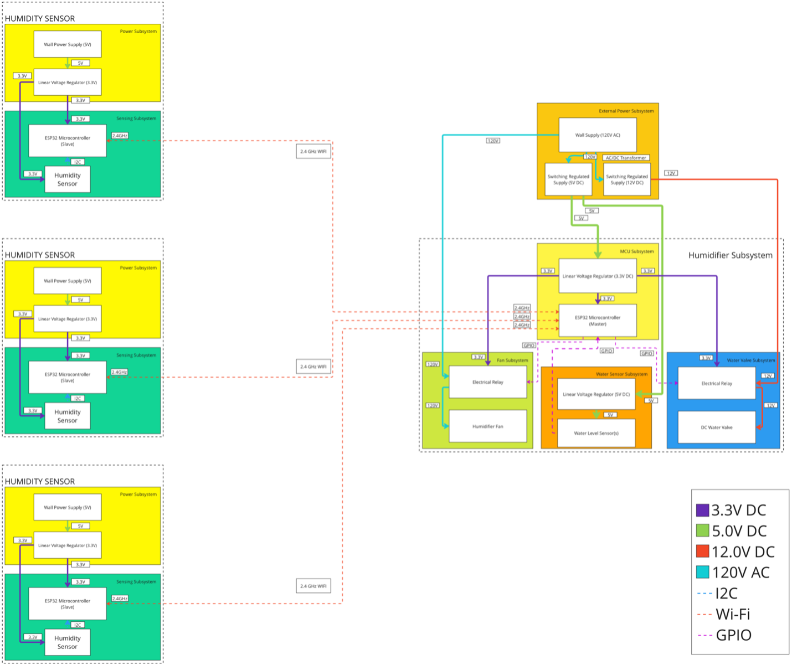{width="6.499235564304462in" height="5.593406605424322in"}Figure 3 -- Overall Block Diagram \[28\]

###### 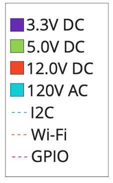{width="1.1161832895888013in" height="1.8076235783027121in"}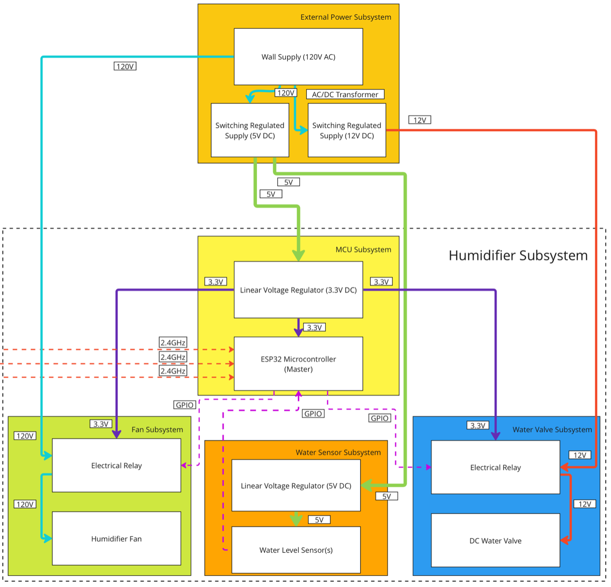{width="6.5in" height="6.25in"}Figure 4 -- Humidifier Subsystem Block Diagram (Close-up) \[16\]

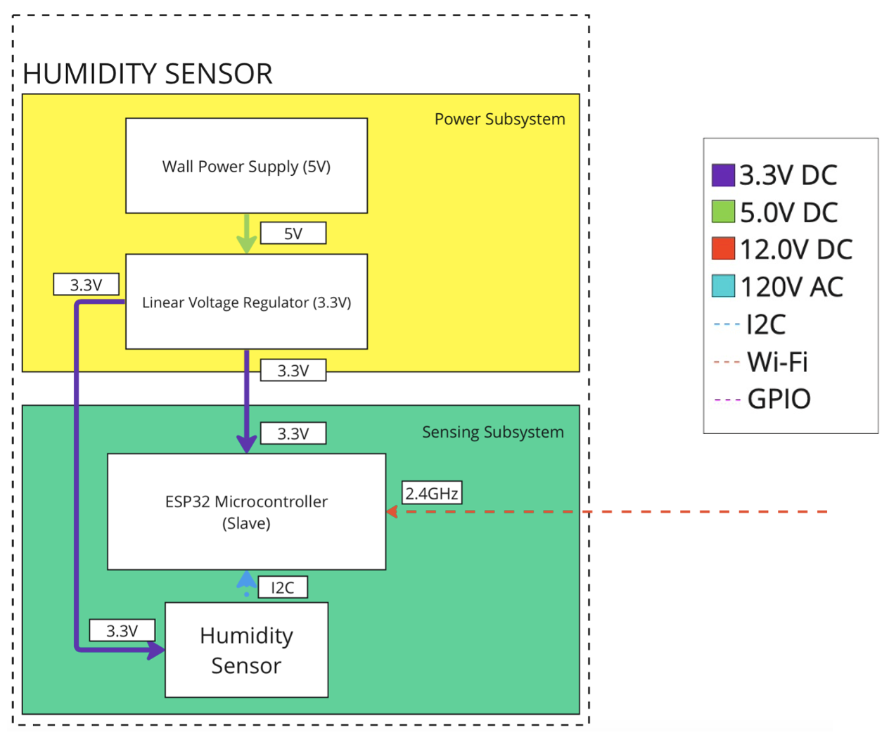{width="6.528230533683289in"
height="5.4333048993875765in"}

###### Figure 5 -- Humidity Sensor Subsystem Block Diagram (Close-up) \[15\]

Our block diagram Figure 3 -- Overall Block Diagram in is divided into
two main parts, the Humidity Sensor subsystem and Humidifier subsystem.
Within the humidifier subsystem, *figure 4,* consists of the MCU, water
sensor, fan, and water valve subsystems. The external power supply
subsystem acts to supply power to our entire humidifier subsystem. The
external power supply subsystem will have a plug from the wall/mains
voltage, which is a 120V AC source. These will directly tie into two
different switching power transformer supplies, which will regulate the
values down to 12V DC for one of them and 5V DC for the other one. The
reason we need these values is to create a baseline to power the rest of
our system, as those are values that we need for specific subsystems
that we will be using. So, for the 120V AC, this will be going to an
electrical relay connected to the fan for our fan subsystem, which will
be used for turning on and off our humidifier fan based off a GPIO
signal from our MCU. Then the 12V DC from the transformer will be used
for the other relay for the water valve subsystem that will be used to
control the DC water valve. This relay would operate like a fan relay,
using a signal to switch on and off the fan, based on the data we
received from the water sensor subsystem. The 5V supply will be used for
the water level and MCU subsystem. The water sensor system will then
have an additional linear voltage regulator to ensure that the value is
5V from the supply, and then use that as our input to the water level
sensors, as they needed 5V to be usable and to send a signal that water
was being sensed when in contact with them. Then as for the MCU system,
this system will be able to control every other subsystem that we have.
The 5V will be dropped to 3.3V, which is the ESP32 MCU voltage needed
for operation, and this voltage to the MCU will be used to control
various parts of our design. So, our microcontroller will use GPIO
signals to communicate between both our relays and the water level
sensors, while using the 2.4 GHz Wi-Fi to communicate with the humidity
sensor subsystem.

The humidity sensor subsystem, *Figure 5 -- Humidity Sensor Subsystem
Block Diagram (Close-up)* *,* is the 2^nd^ subsystem that we will be
using. We will have 3 of these, and the power supply will be a wall plug
connected to our PCB with a barrel jack connector. This wall plug will
convert the 120V AC from the wall to 5V DC to this subsystem, which will
then be regulated to 3.3V from a linear regulator. This will allow us to
have the same function to provide our MCU with the necessary 3.3V, and
then this communicated with the humidifier subsystem MCU as explained
above with the 2.4 GHz Wi-Fi. The ESP32 MCU and the SHT45 humidity
sensor are both included in the sensor subsystem as seen above in
*Figure 5 -- Humidity Sensor Subsystem Block Diagram (Close-up)* . The
SHT45 humidity sensor in this system is used to calculate the humidity
and temperature value around the room, sending back data to the MCU via
standard-mode (100kHz) I2C.

## 2.2 Humidifier Subsystem

### 2.2.1 Overview

Our humidifier subsystem is responsible for controlling the operation of
the humidifier fan and the water valve. It controls the humidifier fan
by receiving humidity and temperature data via 2.4GHz Wi-Fi from the
sensor subsystem. After receiving this data, it will use the humidity
and the temperature, through an algorithm, to control the operation of
the humidifier fan. Similarly, the water valve is controlled depending
on the signal received from two water level sensors.

Referencing Figure 4 -- Humidifier Subsystem Block Diagram (Close-up) ,
we can see that 120V AC goes into the humidifier subsystem. Going
through two switching regulated supplies, it is regulated to 5V DC and
12V DC. This 5V DC is then regulated to 3.3V DC using a linear voltage
regulator. The regulated voltage is used to power the ESP32 and two
relays. The relays are activated using GPIO signals (3.3V DC) from the
ESP32. When the GPIO signal is high, the relay provides 120V AC to the
humidifier and 12V DC, from the switching regulated supply to the water
valve. Finally, the 5V DC is also regulated again with a linear voltage
regulator prior to powering the water level sensors. The water level
sensors will send a high signal to the ESP32 when no water is detected.

{width="5.96923009623797in"
height="4.209073709536308in"}

###### Figure 6 -- Humidifier Subsystem PCB \[29\]

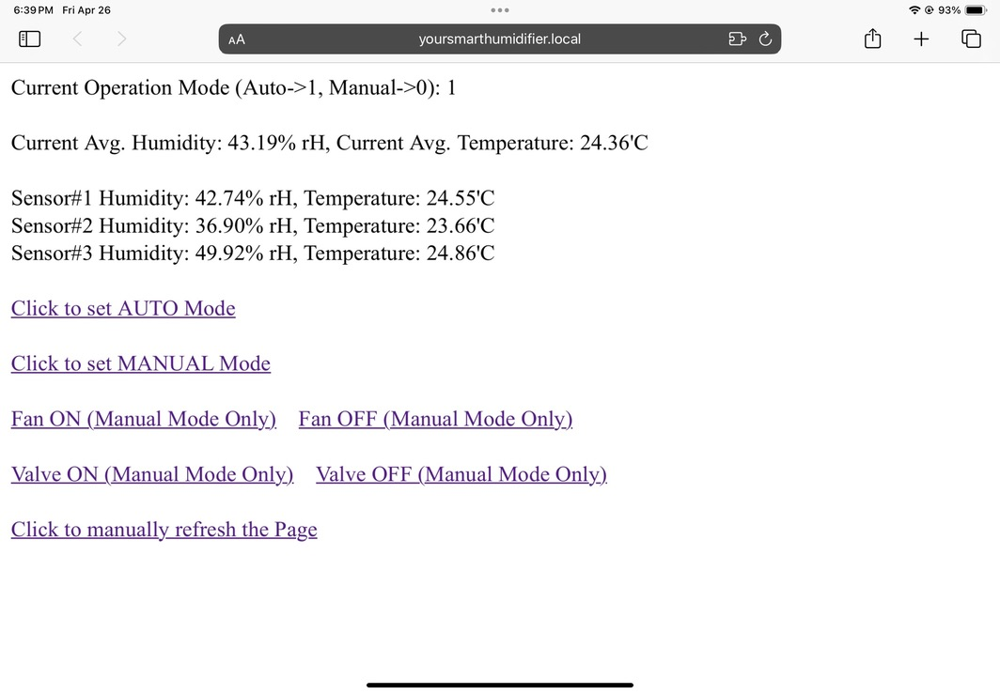{width="5.722222222222222in"
height="3.6923075240594927in"}

###### Figure 7 -- Webserver Webpage \[30\]

To control the humidifier, the webserver in *figure Figure 7 --
Webserver Webpage* was created to display the current averaged humidity
and temperature readings. User, once connects to the ESP32 Wi-Fi
network, can use the following domain address, yoursmarthumidifier.local
to access to the webserver. This design (implemented with mDNS) was
chosen since IP address is hard to memorize and can be changed. The
webserver also provided a way for the user to utilize a *manual* mode
where the humidifier and water valve can be turned on and off manually.
For safety purpose, once user comes back from Auto to Manual mode, the
fan and water valve will always be in off status. Lastly, to advance our
humidity target logic, we put temperature into the algorithm
calculation. Since warmer air, compared to colder air, can handle more
moisture, the humidifier, if the average temperature is above 22'C
(ideal room temperature is 20-22\'C), it will target top half range,
42.5-50% Rh, if it's below 20'C, it will target bottom half range,
35-42.5% Rh and else 35-50% Rh. Furthermore, the web updates every 2
seconds so that there's no need user to manually update to see the
updates.

### 2.2.2 Requirements

i.  Powered by a 5V DC source and is regulated to 3.3V through a linear
    voltage regulator.

ii. Communicates with ESP32 in sensor subsystem to receive humidity and
    temperature data.

iii. ESP32 controls activation of water valve and humidifier fan through
     relays

iv. ESP32 determines water level via two water level sensors

### 2.2.3 Design Decisions

In our original proposal, we planned to use a 12V input into the
humidifier subsystem. This will negate the need for multiple
transformers and multiple voltages. However, 12V regulated to 3.3V using
a linear voltage regulator is highly inefficient. The inefficiencies are
dissipated as heat. As a result, we opted to use a 5V input to the PCB
instead. In the graph below, we can see the voltage from the 3.3V
regulator and the temperature is stable over 1-hour.

To have high voltage components on the board, the design decisions of
isolation, clearance, and creepage had to be used. This can be seen in
*Figure 6 -- Humidifier Subsystem PCB* *,* where the humidifier
subsystem PCB is shown. To isolate our high voltages from our low
voltages, we did not have a copper pour surrounding the 120V AC
components. To increase the clearance and prevent creepage, cutouts were
made on the PCB to physically distance the high voltage from the low
voltage. To prevent noise, we added optocouplers to isolate the noise of
the AC voltage.

### 2.3.4 Humidifier Subsystem RV Table

+-----------------------------------+-----------------------------------+
| Requirements                      | Verification                      |
+===================================+===================================+
| -   Provide 3.3V +/- 0.5% from an | -   Use multimeter to test and    |
|     input voltage of 5V +/- 0.1%  |     take average voltage output   |
|     DC source                     |     over 1-hour to test stability |
|                                   |     (*Figure - A-1* , *Figure -   |
| -   Thermal stability maintains   |     A-2* )                        |
|     below 120'C                   |                                   |
|                                   | -   Monitor heat dissipation with |
|                                   |     thermal laser gun over an     |
|                                   |     average of 1-hour use time,   |
|                                   |     expected +/- 5'C under        |
|                                   |     load (*Figure - A-3* )        |
+-----------------------------------+-----------------------------------+
| -   ESP32 communication with      | -   Verify functionality of ESP32 |
|     remote sensor ESP32 utilizing |     Wi-Fi component by creating   |
|     2.4GHz Wi-Fi                  |     an access point, and          |
|                                   |     accessing access point to     |
|                                   |     remotely turn on LED          |
|                                   |     lights (*Figure - A-4* )      |
|                                   |                                   |
|                                   | -   Verify communication between  |
|                                   |     two ESP32 boards by sending   |
|                                   |     command to turn on LED light  |
|                                   |     from one ESP32                |
|                                   |     board (*Figure - A-4* )       |
|                                   |                                   |
|                                   | -   Verify thermal performance of |
|                                   |     ESP32 chip during operation   |
|                                   |     by probing with a laser       |
|                                   |     thermal gun (*Figure - A-1* ) |
+-----------------------------------+-----------------------------------+
| -   ESP32 control of activation   | -   Verify functionality of ESP32 |
|     and deactivation of water     |     communication with DC relay   |
|     valve                         |     by sending activation signal  |
|                                   |     to water valve/fan DC relay   |
| -   ESP32 control of activation   |     controller, and when signal   |
|     and deactivation of fan       |     is received, DC relay         |
|                                   |     controllers output a lit LED  |
|                                   |     light (*Figure - A-5* )       |
|                                   |                                   |
|                                   | Probe the output voltage of the   |
|                                   | DC relay controllers to make sure |
|                                   | it is 12V +/- 0.5%  (             |
|                                   |                                   |
|                                   | -   *Figure - A-6* )              |
+-----------------------------------+-----------------------------------+
| -   ESP32 detects signals from    | -   Contact/No Contact water to   |
|     two water-level sensors       |     the water-level sensors and   |
|                                   |     check through Arduino IDE to  |
|                                   |     see if ESP32 receives         |
|                                   |     contact/no contact signal     |
|                                   |     from the two water-level      |
|                                   |     sensors *(Figure - A-7* *)*   |
|                                   |                                   |
|                                   | -   Water level sensor low signal |
|                                   |     when in contact with water,   |
|                                   |     and high signal when not in   |
|                                   |     contact with water (*Figure - |
|                                   |     A-8* )                        |
+-----------------------------------+-----------------------------------+

The data we have in *Figure - A-2* *and Figure - A-3* show the
temperature and voltage graph over time that was measured in our
verification tests. As listed, the voltage was measured through the
multimeter over an entire hour, as seen in the graph in *Figure - A-2*
*,* taking a data point every minute. The average voltage is relatively
stable with no major fluctuations and proves that our input source is
stable to the condition we want. The temperature from the thermal laser
gun is the same procedure, and as you can see, the temperature starts
off at room temperature and then slowly builds up as the system consumes
power and expels energy in the form of heat. Then it stabilizes after a
while indicating that temperature is within operating range for our
components. So the first 2 requirements have been fulfilled. Then the
next requirement is that the two MCUs can communicate correctly with 2.4
GHz Wi-Fi. So, we first tested the Wi-Fi capability independently by
itself by creating an access point. We would be able to see this access
point by connecting it to with our phone. Then we tested the
communication between two boards with this now-working Wi-Fi. We created
a light to blink on one board when receiving a signal from a separate
MCU, which worked both ways, so this proves dual-mode communication of
reading and writing and also the Wi-Fi running at full load. Then we
tested the thermal performance of the ESP32 chip with the same thermal
laser procedure, concluding that the temperature values were within
acceptable ranges.

For our next requirement, we needed to verify both the relays to make
sure the water valve and fan can both be controlled through GPIO signals
from our MCU. These relays would act to turn on and off by sending an
electronic signal. The way we verified this step by step was to
continuity test the relay to make sure the switching properly works, and
then sending signals to the specific relay to make sure that the LED
light signal turns on as a test when in normally open and normally
closed configurations. Then we probed voltage to make sure the proper
amount is going through, anticipating the relay electromagnetic coil to
work as well. Finally, the last requirement was to test the water level
sensors and see a signal received from them in contact with water or
not. We set the signals listed as such in the RV table below.

## 2.3 Humidity Sensor Subsystem

### 2.3.1 Overview

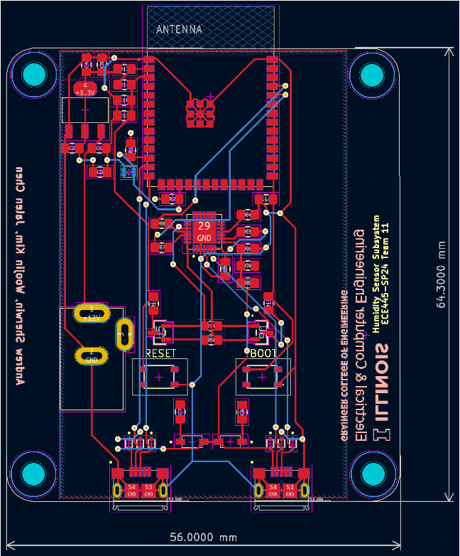{width="3.3229166666666665in"
height="4.007638888888889in"}Each of the three humidity sensor
subsystems acquires temperature and relative humidity data from its own
SHT45 sensor mounted back of the PCB through I2C, then sends the message
structure including the data to the humidity subsystem's ESP32 over
2.4GHz Wi-Fi. 5V DC input is regulated by linear voltage regulator, then
provided to both ESP32 and SHT45.

###### Figure 8 -- Sensor Subsystem PCB \[31\]

### 2.3.2 Requirements

The sensor system satisfies the following requirements:

i.  Voltage needs to be stable, 5V +/- 0.1% DC source voltage and 3.3V
    +/- 0.5% input

ii. System temperature needs to be maintained below 120'C

iii. ESP32 needs to receive temperature and humidity data at least once
     a minute

iv. Sensor needs to accurately measure humidity data (at least range in
    between 25% - 55%  Relative-Humidity)

### 2.3.3 Design Decisions

At the back of our sensor subsystem enclosure, a hole with a rubber
grommet is designed to isolate the SHT45 sensor. This will prevent
humidity inside the box from affecting the SHT45 sensor. Furthermore,
the SHT45 sensor is on the back of the PCB, as seen in *Figure 8 --
Sensor* Subsystem *PCB* . This design decision was made so that
temperature from the ESP32 and the linear voltage regulators will have
less effects on the SHT45 humidity and temperature sensor.

If completed again, the PCB design will not have the programming
components for the ESP32. The ESP32 will be programmed on a separate PCB
and transferred and soldered onto the final sensor subsystem PCB. This
will compact the size of the PCB.

### 2.3.4 Humidity Sensor Subsystem RV Table

+----------------------------------+-----------------------------------+
| Requirements                     | Verification                      |
+==================================+===================================+
| -   Provide 3.3V +/- 0.5% from   | -   Use multimeter to test and    |
|     an input voltage of 5V +/-   |     take average voltage output   |
|     0.1% DC source               |     over 1-hour to test           |
|                                  |     stability  (*Figure - A-9* *, |
| -   Thermal stability maintains  |     Figure - A-10* *)*            |
|     below 120'C                  |                                   |
|                                  | -   Monitor heat dissipation with |
|                                  |     thermal laser gun over an     |
|                                  |     average of 1-hour use time,   |
|                                  |     expected +/- 5'C under load   |
|                                  |     (*Figure - A-11* )            |
+----------------------------------+-----------------------------------+
| -   ESP32 communication with     | -   Verify communication between  |
|     humidity sensor receiving    |     ESP32 and humidity sensor     |
|     humidity data at least once  |     Arduino IDE by checking       |
|     in a minute                  |     humidity data ESP32           |
|                                  |     receives   (*Figure - A-12* ) |
| -   Humidity sensor measuring    |                                   |
|     humidity data at least       | -   Compare the humidity data     |
|     between 25% - 55%            |     received by ESP32 to the      |
|                                  |     commercial humidity sensor    |
|                                  |     and check if the humidity is  |
|                                  |     within +/- 3% *(Figure -      |
|                                  |     A-12* *)*                     |
|                                  |                                   |
|                                  | -   Make the air dry/moist to see |
|                                  |     if the sensor can measure     |
|                                  |     humidity between 25% - 55%    |
|                                  |     *(Figure - A-12* *)*          |
|                                  |                                   |
|                                  | -   Exhale on sensor to see       |
|                                  |     humidity levels are raised    |
|                                  |     *(Figure - A-12* *)*          |
|                                  |                                   |
|                                  | -   Compare humidity reading with |
|                                  |     reference humidity reader     |
|                                  |     *(Figure - A-12* *)*          |
+----------------------------------+-----------------------------------+

*Figure - A-9* shows the multimeter and thermal laser gun those used to
verify the requirements of the subsystem. In the next figure, *Figure -
A-10* shows the data we have for measured voltage every minute over an
hour. Two voltage graphs show that the two voltages are stable within
the proposed gap. *Figure - A-11* shows the data we have for measuring
temperature every minute over an hour. It starts with room temperature
and converges to the stability point which is under 120\'C. These
indicate that the first two requirements are verified as we supposed.
Next, we verified the steady reading of SHT45 data by checking the
Serial Monitor of Arduino IDE (check so that ESP32 can obtain the SHT45
data at least once a minute), this is further verified as the data gets
updated every few seconds on the webserver. Lastly, in*Figure - A-12* ,
it shows the comparison of our sensors data with the commercial humidity
sensor and verified that the difference between the average humidity and
the commercial humidity data is within a 3% gap. Finally, by blowing to
the sensor manually, we also verified the ESP32 reacts to the change in
moisture in real-time.

# 3 Cost Analysis

## 3.1 Parts and Materials

For this project, we created 2 different PCB boards to fulfill our 3
humidity sensor subsystems and our central humidifier subsystem. The
parts used are provided, with name, part number, amount required per
system, and the individual cost added up together. *Figure C-1 - Sensor
Subsystem Parts* and *Figure C-2 - Humidifier Subsystem Parts* is a
table of the required parts and materials for just the PCBs. We also
purchased additional components, wires, and mechanical tools to help us
connect the project together into a design that enables functionality
without loose ends, such as connections hanging around. The total cost
adds up to around \$680.95.

## 3.2 Estimated Hours of Development

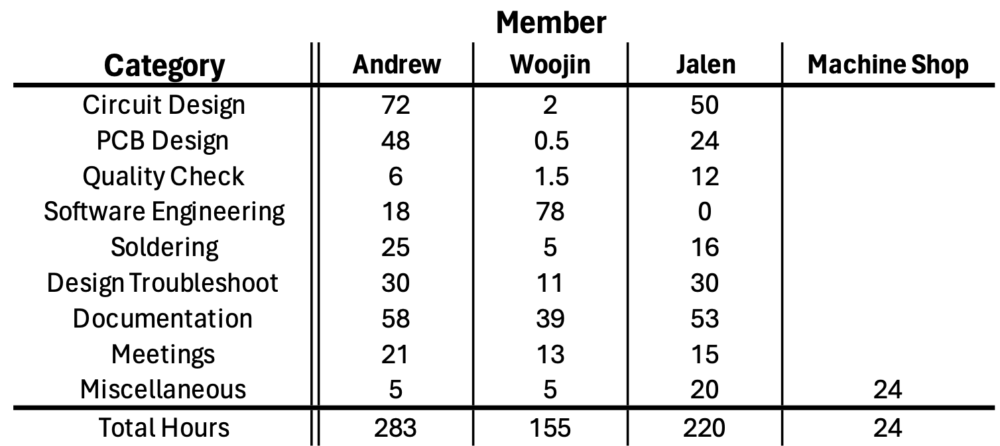{width="6.430555555555555in"
height="2.873611111111111in"}

###### Table 1 -- Estimated Development Hours \[46\]

With mixed electrical engineers and computer engineers in our group, we
all have different hourly wages. Using the average UIUC ECE computer
engineering published salary in 2021-2022 (\$109,176.00), using 2080
work hours in a work year, we can expect an average hourly salary of
\$52.49.

$\frac{109,176.00}{2080\, hours} = 52.49\, per\, hour$ (1)

Summing up the total labor hours in *table 1* above and multiplying it
by the average salary *(1*), we obtain the total cost for labor to be:
\$34,538.42 for this project.

Aside from our own hours of labor, the machine shop performed 24 hours
of work to modify our humidifier with some parts included in *Table 1 --
Estimated Development Hours* *.*The machine-shop technician's hourly
cost is not public, so we will not include the cost in the total cost of
development above.

## 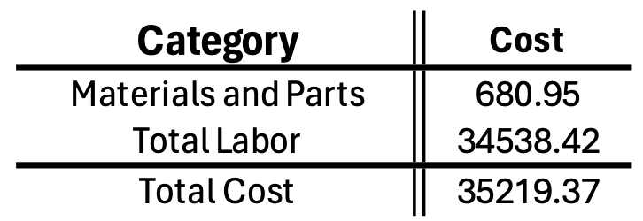{width="5.041666666666667in" height="1.7361111111111112in"}3.3 Approximate Total Cost

###### Table 2 -- Total Cost \[47\]

In total, the humidifier project cost \$35,219.37, as seen in *Table 2
-- Total Cost* . Most of the cost is from 16 weeks (about 3 and a half
months) of labor, as broken down in *section 3.2* above.

# 4 Conclusion

## 4.1 Accomplishments and Uncertainties

Our project was very successful. We have completed all the high-level
requirements that we set out to do. The sensor subsystem was able to
successfully receive humidity and temperature data from the SHT45 sensor
and relay the data to the humidifier subsystem via 2.4GHz Wi-Fi. Taking
the humidity and temperature data, the humidifier subsystem was able put
the data through an algorithm to determine the operation of the
humidifier fan. Similarly, taking the data from the two water level
sensors, the humidifier subsystem was able to determine the operation of
the water valve. As a bonus, a webpage was created to view the humidity
and temperature data live. On top of that, manual controls were created
to operate the humidifier and water valve directly by the user. There
were no uncertainties in our project, as all the parts were fully
functional. We were able to run the humidifier for 4-weeks non-stop. The
humidifier system never had a problem in the 4 weeks and proves the
success of our project. However, there are always ways we can improve
our product.

## 4.2 Future Work

In the future, we hope to link our humidifier with Amazon Alexa, Apple
HomeKit, and Google Assistant. This way, the humidifier can be manually
controlled, even when the user is not connected to the access point. The
UI of the webpage can be improved also. We will use buck converters
instead of linear voltage regulators to power our PCB. This will allow
us to only use the 12V input in our humidifier subsystem. Furthermore,
we can reduce the size of the PCB by preprogramming the ESP32, then
soldering the programmed ESP32 onto the PCB. Aside from that, creating
our own switching regulated supply would help save even more costs in
the final product.

Our product is very modular. Any humidifier on the market can utilize
it. With our abundant testing, we are confident that our product is
almost ready for the market. Without the water level sensing system and
the water valve, anyone currently having a humidifier, or is buying a
manual humidifier can use our auto on-off system. To have a humidifier
with an auto-refilling system as we proposed, we will need more funding
for further research and development to build a new humidifier ground
up. These are the goals we have for the future, though we are not able
to provide our whole project for the market currently, we are happy that
we are able to provide an alternative product that reaches even more
people to help fund our dream product of a fully automatic humidifier.

# 5 Appendix

## 5.1 Appendix A -- RV Table Verifications

###### 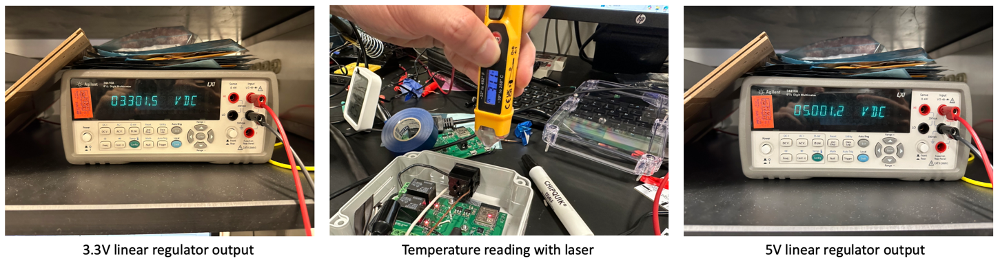{width="6.5946948818897635in" height="1.7437904636920385in"}Figure - A-1 \[32\]

###### 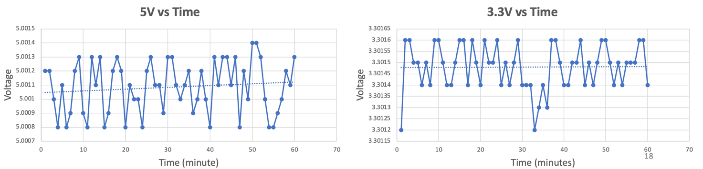{width="6.698864829396325in" height="1.610304024496938in"}Figure - A-2 \[33\]

###### 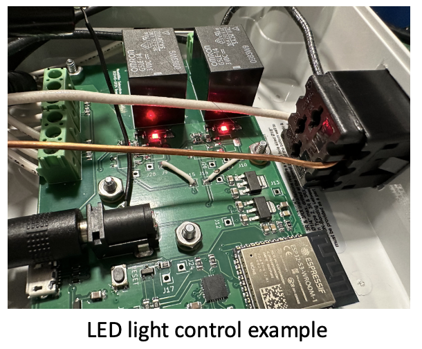{width="2.965961286089239in" height="2.4505643044619423in"}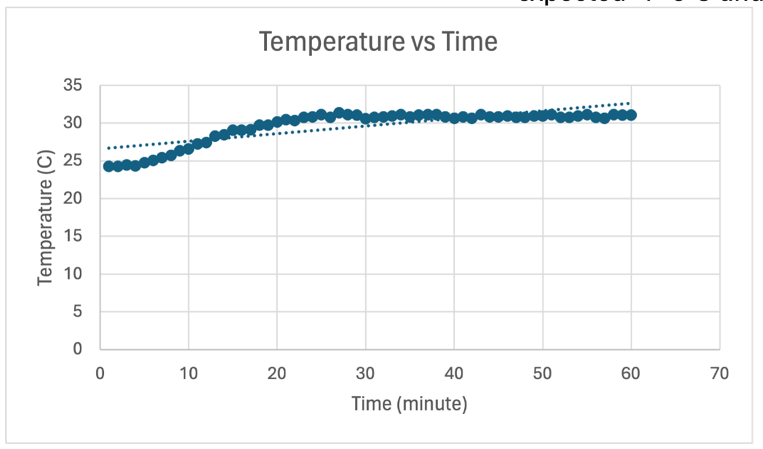{width="3.473906386701662in" height="2.0415682414698164in"}Figure - A-3 \[34\]

###### 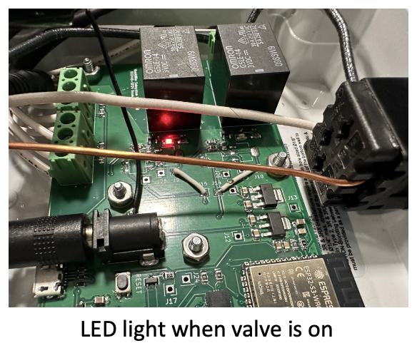{width="2.9122594050743658in" height="2.433532370953631in"}Figure - A-4 \[35\]

###### Figure - A-5 \[36\]

###### 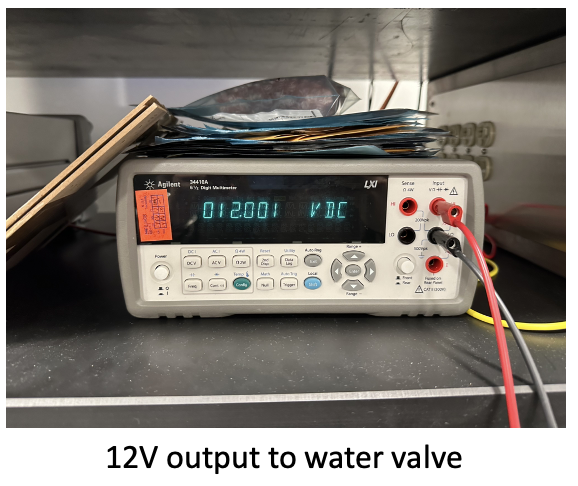{width="2.8743055555555554in" height="2.4166666666666665in"}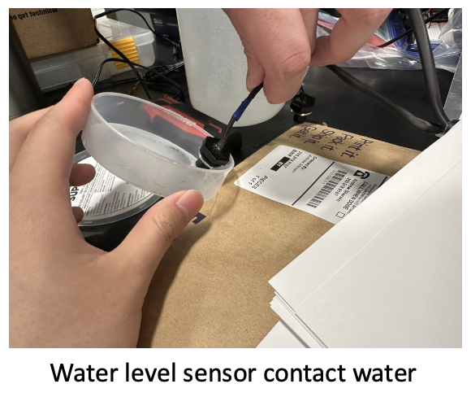{width="2.9490594925634297in" height="2.4812784339457568in"}Figure - A-6 \[37\]

###### 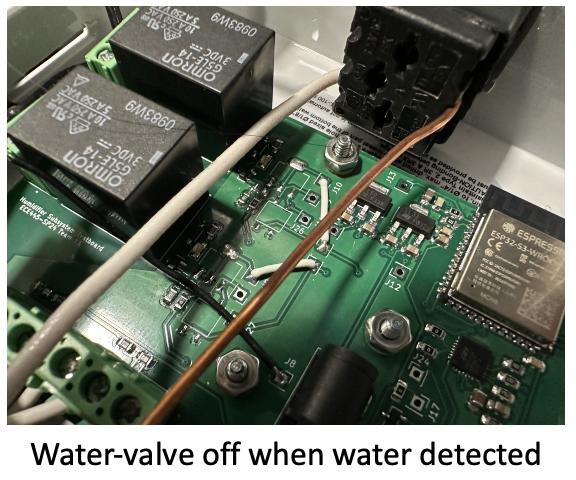{width="2.8916666666666666in" height="2.3186811023622047in"}Figure - A-7 \[38\]

###### Figure - A-8 \[39\]

###### 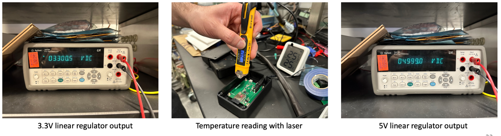{width="6.5in" height="1.78125in"}Figure - A-9 \[40\]

###### 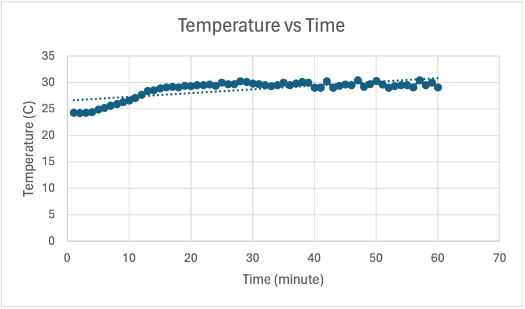{width="4.663547681539807in" height="2.7451345144356956in"}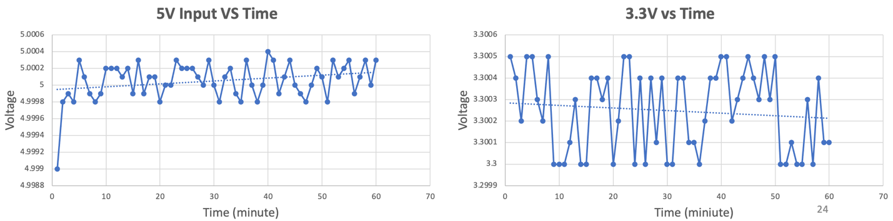{width="6.5in" height="1.6145833333333333in"}Figure - A-10 \[41\]

###### Figure - A-11 \[42\]

###### 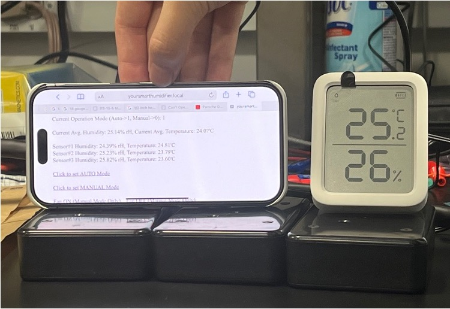{width="4.327432195975503in" height="2.9772725284339456in"}Figure - A-12 \[43\]

## 5.2 Appendix B -- Schematics

5.2.1 Appendix B.1 - Humidifier Subsystem

###### 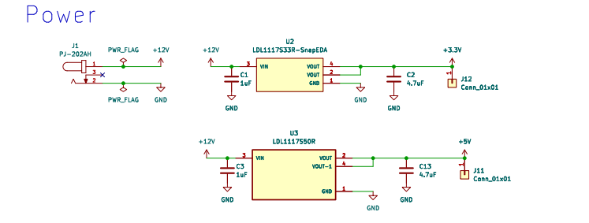{width="6.5in" height="2.4583333333333335in"}Figure - B-1 \[11\]

###### 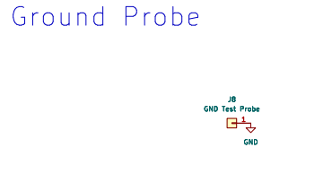{width="3.854704724409449in" height="2.2190594925634297in"}Figure - B-2 \[11\]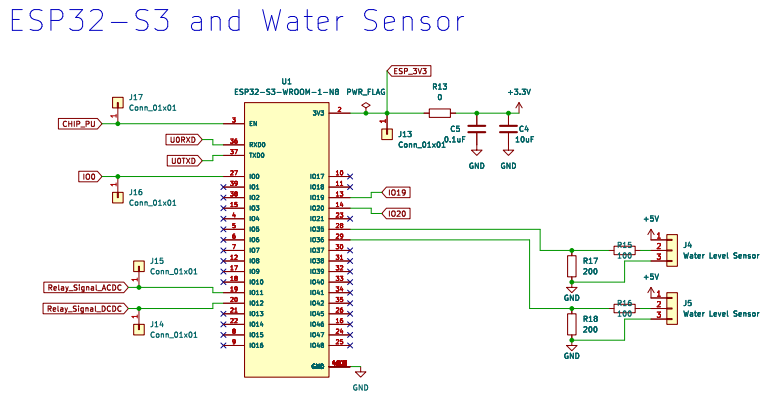{width="6.5in" height="3.53125in"}Figure - B-3 \[10\]\[11\]

###### 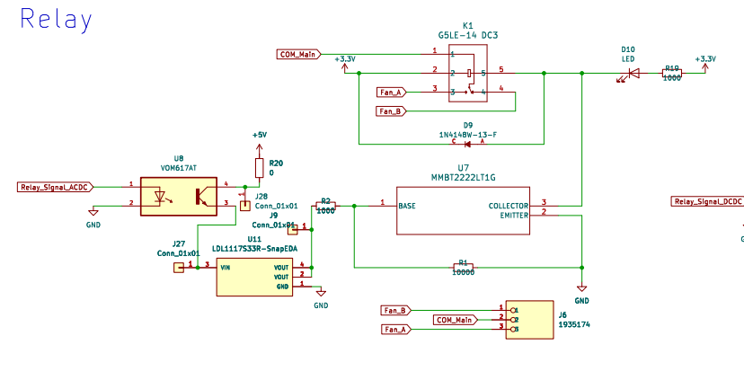{width="6.5in" height="3.2395833333333335in"}Figure - B-4 \[11\]

###### 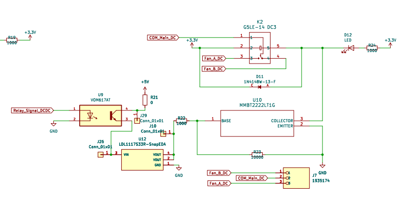{width="6.5in" height="3.3125in"}Figure - B-5 \[11\]

###### 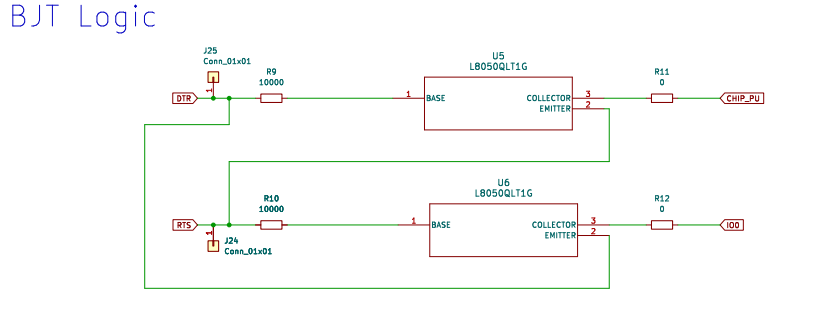{width="6.5in" height="2.5104166666666665in"}Figure - B-6 \[10\]\[11\]

###### 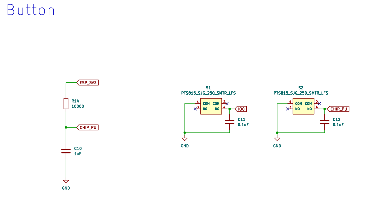{width="6.5in" height="3.7916666666666665in"}Figure - B-7 \[10\]\[11\]

###### 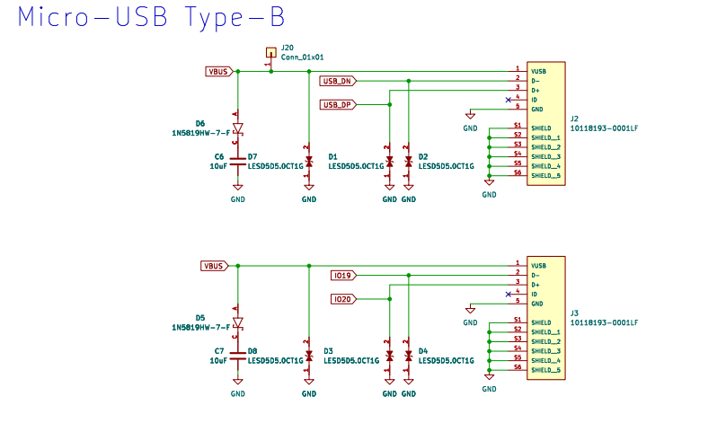{width="6.5in" height="3.8854166666666665in"}Figure - B-8 \[10\]\[11\]

###### 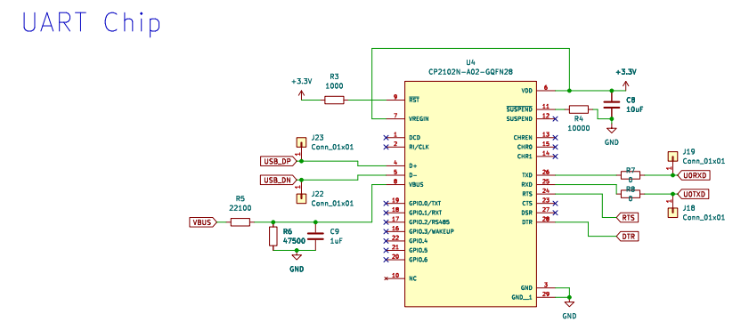{width="6.5in" height="2.8645833333333335in"}Figure - B-9 \[10\]\[11\]

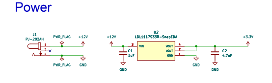{width="5.771640419947507in"
height="1.7710804899387576in"}5.2.2 Appendix B.2 - Humidity Sensor
Subsystem

###### 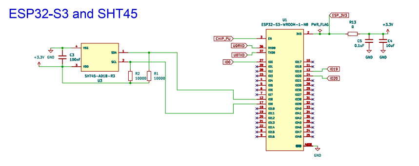{width="6.5in" height="2.5833333333333335in"}Figure - B-10 \[10\]

*Figure - B-11 \[10\]*

## 5.3 Appendix C -- Required Parts and Cost

###### 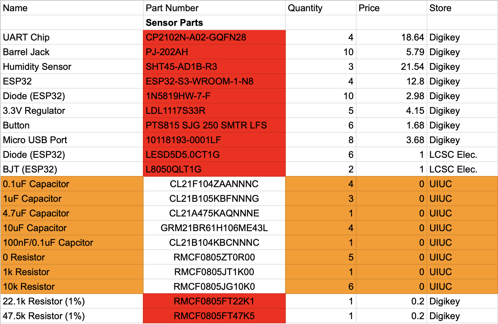{width="6.5in" height="4.239583333333333in"}Figure C-1 - Sensor Subsystem Parts \[44\]

###### 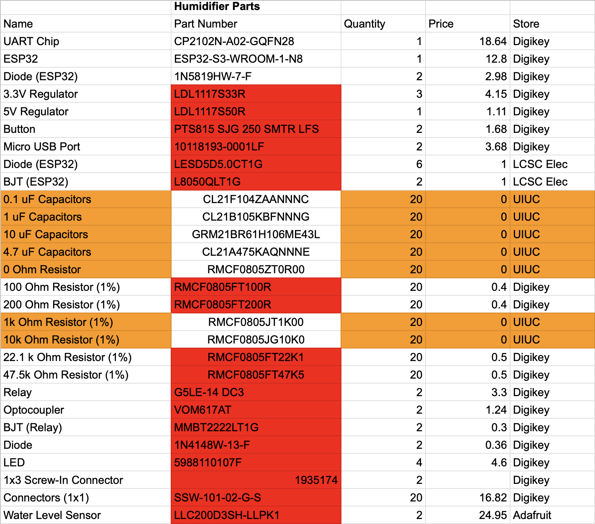{width="6.5in" height="5.72916447944007in"}Figure C-2 - Humidifier Subsystem Parts \[45\]

## 5.4 Appendix D -- Ethics and Safety

For our initial examination of ethics, we were able to justify our
project using the IEEE code of ethics \[6\]\[13\]. As students and
soon-to-be workers, we know that whatever we do will have an impact on
the world, primarily through the products and services we work on.
Therefore, we must make sure to set some ethical guidelines that match
with the code. 

 5.4.1 Ethics

i.  To uphold the highest standards of integrity, responsible behavior,
    and ethical conduct in professional activities. \[6\]

> a\. We will keep an open-minded state to each other\'s opinions.
> Utilizing everyone's opinions, we will try to find the most ideal
> solution to our problems. 
>
> b\. We will keep the integrity of our research to the highest degree.
> All data collected will be the truthful original and will not be
> "tuned" in any way. 
>
> c\. We will keep the safety of our members and those working around us
> to the utmost highest standard. 
>
> d\. We will adhere to the rules and regulations of the University of
> Illinois and ECE445's lab-conduct rules. \[48\]
>
> e\. Constructive advice and criticisms will be accepted, and any forms
> of bribery will not be tolerated. 

ii. To treat all persons fairly and with respect, to not engage in
    harassment or discrimination, and to avoid injuring others. \[6\]

> a\. We will treat all members within and outside our group with
> respect on physical and non-physical standpoints. 
>
> b\. Sexual harassment is not tolerated and will be reported to
> appropriate parties. 

iii. To strive to ensure this code is upheld by colleagues and
     co-workers.\[6\]

> a\. We will strive to uphold this code of conduct provided from IEEE
> and in our team contract. Any behavior outside the rules will be
> reported to the correct authorities.

iv. To seek, accept, and offer honest criticism of technical work, to
    acknowledge and correct errors, to be honest and realistic in
    stating claims or estimates based on available data ...\[6\]

> a.    A central ethical concern includes directly impacting humans as
> a first resort without being able to test otherwise. For example, for
> most scientific products, humans are the final stage of a trial in a
> product because all previous stages have been cleared or given
> approval through uses of inanimate objects or lab animals. Our problem
> is generally a comfort-based one, and so the general ethical concern
> would be the first stage exposure to humans since there would not be a
> test trial. If our main issue is comfort, we will never know how it
> feels until actual humans have tested it. Therefore, as one of the
> IEEE Code of Ethics indicates \[6\], we will seek and accept any
> technical criticisms from TA, instructors, and machine shop, be
> realistic and responsible to revise the problem until we reach
> agreement. On top of that we will measure the humidity carefully and
> regulate with the correct amounts of moisture, making sure that we
> only deviate from the average quantity only once we have received
> indication that it is comfortable. 
>
> In this section, we consider every type of the most common situations
> that could occur when using our automatic humidifier product. 

i.  A safety concern would be the wall plug power. This is 120 V AC
    power typically, and so to prevent electrocution and shock issues,
    we would need to be aware of our surroundings and to connect the
    plug into the wall without any external connections to the outlet
    interrupting it in any way, such as holding loose wires or the metal
    section of the plug when you are plugging it into the wall. 

ii. A safety concern is the issue of potential bacteria and mold. Our
    automatic humidifier should get rid of this, but this issue could
    severely impact the humidifier if there turns out to be traces of
    something contagious that can be widespread with the device. The
    dangers of something airborne that could get into your lungs would
    be catastrophic if not regulated correctly. 

iii. Another possible safety issue could be the moving parts of a fan
     that could injure you if you try to touch the mechanical
     components. The fan's motor will likely be insulated from external
     touch, but there is always a chance that something breaks and
     another chance that the moving part accidentally comes in contact
     with someone's finger or something easily mistouched, leading to a
     higher chance of injury. 

iv. A common matter that arises as well is if there is a connected cable
    that meets water. Our humidifier will likely be powered through a
    wired connection, and any water that comes into contact either from
    the humidifier or an external water source will damage the system,
    or even worse, cause physical harm to someone. This safety issue
    would need to be fixed through epoxy or some type of non-porous
    material insulating the device and its connections. 

```{=html}
<!-- -->
```
v.  Dangerous chemicals are a final hazard that could be caused
    intentionally or by accident. Chemicals could be an issue if put
    inside the supply which normally contains water. If a dangerous
    fluid was put in the supply on purpose, then the humidifier might
    act as normal, sensing the humidity levels and then dispersing a
    life-threatening liquid instead of water. This would cause great
    harm and even possibly death if misused, so it is of utmost
    importance that the person using the device is careful and is
    sensible. Otherwise, the designers are not subject to responsibility
    and take no claim in the misuse of the product, which in that case,
    the user should refer to the instructions provided. 

[]{#_Toc165415281 .anchor}

## 5.5 Appendix E - References 

1.  F. Hecht, "Wifi Propagation," *freedom*, 2017.
    https://doc.freefem.org/tutorials/wifiPropagation.html (accessed
    Mar. 29, 2024).

2.  M. Marwell, "Issues with the I^2^C (Inter-IC) Bus and How to Solve
    Them," *DigiKey*, Aug. 09, 2018. Accessed: Mar. 29, 2024.
    \[Online\]. Available:
    https://www.digikey.com/en/articles/issues-with-the-i2c-bus-and-how-to-solve-them

3.  MetaGeek, "Wi-Fi and Non Wi-Fi Interference," *MetaGeek*, 2024.
    https://www.metageek.com/training/resources/wifi-and-non-wifi-interference/
    (accessed Mar. 29, 2024).

4.  A. V. Arundel, E. M. Sterling, J. H. Biggin, and T. D. Sterling,
    "Indirect health effects of relative humidity in indoor
    environments.," *Environmental Health Perspectives*, vol. 65, no.
    65, pp. 351--361, Mar. 1986, doi: 10.1289/ehp.8665351.

5.  V. Perrone *et al.*, "The Epidemiology, Treatment Patterns and
    Economic Burden of Different Phenotypes of Multiple Sclerosis in
    Italy: Relapsing-Remitting Multiple Sclerosis and Secondary
    Progressive Multiple Sclerosis," *Clinical Epidemiology*, vol.
    Volume 14, no. 14, pp. 1327--1337, Nov. 2022, doi:
    10.2147/clep.s376005.

6.  IEEE, "IEEE Code of Ethics," *IEEE Code of Ethics*, 2020.
    https://www.ieee.org/about/corporate/governance/p7-8.html (accessed
    Mar. 29, 2024).

7.  University of Illinois, "Salary Averages," *UIUC*, 2022.
    https://ece.illinois.edu/admissions/why-ece/salary-averages
    (accessed Mar. 29, 2024).

8.  Environmental Protection Agency, "Care for your air: A guide to
    indoor air quality," *US EPA*, Aug. 07, 2023.
    https://www.epa.gov/indoor-air-quality-iaq/care-your-air-guide-indoor-air-quality
    (accessed Mar. 25, 2024).

9.  Sensirion, "Datasheet -SHT4x," *Sensirion*, Aug. 2023.
    https://sensirion.com/media/documents/33FD6951/6555C40E/Sensirion_Datasheet_SHT4x.pdf

10. A. Sherwin, *ECE445 Team 11 - Sensor Subsystem Schematic*. 2024.

11. A. Sherwin, *ECE445 Team 11 - Humidifier Subsystem Schematic*. 2024.

12. Espressif, "ESP32-S3-WROOM-1 ESP32-S3-WROOM-1U
    Datasheet," *Espressif*, 2023.
    https://www.espressif.com/sites/default/files/documentation/esp32-s3-wroom-1_wroom-1u_datasheet_en.pdf

13. IEEE, "IEEE Code of Ethics," *IEEE Code of Ethics*, Jun. 2020.
    https://www.ieee.org/about/corporate/governance/p7-8.html (accessed
    Mar. 26, 2024).

14. Espressif, "sch_esp32-s3-devkitc-1_v1_20210," *Espressif*, Apr.
    13, 2022.
    https://dl.espressif.com/dl/schematics/SCH_ESP32-S3-DevKitC-1_V1.1_20220413.pdf
    (accessed Mar. 26, 2024).

15. A. Sherwin, *Sensor Subsystem Block Diagram (Close-Up)*. 2024.

16. A. Sherwin, Humidity Subsystem Block Diagram (Close-Up). 2024.

17. D. Workshop, "ESP NOW - Peer to Peer ESP32 Communications," DroneBot
    Workshop, Apr. 03, 2022. https://dronebotworkshop.com/esp-now/

18. K. Rembor, "Adafruit Sensirion SHT40, SHT41 & SHT45 Temperature &
    Humidity Sensors," Adafruit Learning System, Feb. 04, 2021.
    https://learn.adafruit.com/adafruit-sht40-temperature-humidity-sensor/arduino

19. cplusplus, "std::chrono::high_resolution_clock::now," cplusplus.
    https://cplusplus.com/reference/chrono/high_resolution_clock/now/
    (accessed Apr. 20, 2024).

20. cplusplus, "std::chrono::nanoseconds," cplusplus.
    https://cplusplus.com/reference/chrono/nanoseconds/ (accessed Apr.
    20, 2024).

21. me-no-dev, "ESPAsyncWebServer/README.md at master ·
    me-no-dev/ESPAsyncWebServer," GitHub.
    https://github.com/me-no-dev/ESPAsyncWebServer/blob/master/README.md

22. Tea, "ESP32 Web Server periodic updating problem," Stack Overflow.
    https://stackoverflow.com/questions/64610221/esp32-web-server-periodic-updating-problem

23. antepher, "ESP32 Arduino: HTTP server over soft AP," techtutorialsx,
    Jan. 07, 2018.
    https://techtutorialsx.com/2018/01/07/esp32-arduino-http-server-over-soft-ap/

24. ESPRESSIF, "ESP-NOW - ESP32 - --- ESP-IDF Programming Guide v5.2.1
    documentation," espressif.com.
    https://docs.espressif.com/projects/esp-idf/en/stable/esp32/api-reference/network/esp_now.html

25. Center for Drug Evaluation and Research, "Use Caution When Giving
    Cough and Cold Products to Kids," *U.S. Food and Drug
    Administration*, 2018.
    <https://www.fda.gov/drugs/special-features/use-caution-when-giving-cough-and-cold-products-kids>
    (accessed May 01, 2024).

26. A. Sherwin, Consumer Visual Aid. 2024.

27. A. Sherwin, Component Visual Aid. 2024.

28. A. Sherwin, Overall Block Diagram. 2024.

29. A. Sherwin, Humidity Subsystem PCB. 2024.

30. A. Sherwin, Webserver Webpage. 2024.

31. A. Sherwin, Sensor Subsystem PCB. 2024.

32. A. Sherwin, RV Table A-1. 2024.

33. A. Sherwin, RV Table A-2. 2024.

34. A. Sherwin, RV Table A-3. 2024.

35. A. Sherwin, RV Table A-4. 2024.

36. A. Sherwin, RV Table A-5. 2024.

37. A. Sherwin, RV Table A-6. 2024.

38. A. Sherwin, RV Table A-7. 2024.

39. A. Sherwin, RV Table A-8. 2024.

40. A. Sherwin, RV Table A-9. 2024.

41. A. Sherwin, RV Table A-10. 2024.

42. A. Sherwin, RV Table A-11. 2024.

43. A. Sherwin, RV Table A-12. 2024.

44. A. Sherwin, Sensor Subsystem Parts. 2024.

45. A. Sherwin, Humidifier Subsystem Parts. 2024.

46. A. Sherwin, Estimated Development Hours. 2024.

47. A. Sherwin, Total Cost. 2024.

48. Engineering IT Shared Services, "Lab :: ECE 445," *Senior Design
    Laboratory*, 2020.
    https://courses.engr.illinois.edu/ece445/lab/index.asp (accessed May
    01, 2024).
